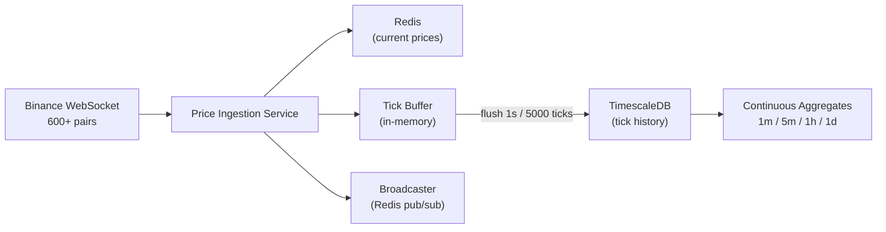

# Phase 1: Foundation Implementation Plan

## Goal

All 600+ Binance USDT trading pairs streaming to Redis + TimescaleDB 24/7 with zero data loss.

## Architecture Overview

## Execution Order (31 tasks, one file at a time per cursor rules)

Phase 1 is broken into 9 sub-groups. Each group must complete before the next begins, but within a group, files are created sequentially.

---

### Step 1: Project Setup (6 files)

Create the project skeleton, dependency files, and tooling config.

- `**requirements.txt**` -- Pin all production dependencies:
  - `fastapi`, `uvicorn[standard]`, `pydantic-settings`, `sqlalchemy[asyncio]>=2.0`, `asyncpg`, `alembic`, `redis[hiredis]>=5.0`, `websockets`, `celery[redis]`, `pyjwt`, `bcrypt`, `structlog`, `prometheus-client`, `httpx`
- `**requirements-dev.txt**` -- Dev/test dependencies:
  - `pytest`, `pytest-asyncio`, `pytest-cov`, `ruff`, `mypy`, `locust`, `factory-boy`, `aioresponses`
- `**.env.example**` -- All env vars from [developmantPlan.md](developmantPlan.md) Section 21 (POSTGRES_USER, REDIS_URL, BINANCE_WS_URL, JWT_SECRET, etc.)
- `**.gitignore**` -- Python, Docker, IDE, `.env`, `__pycache`__, `.venv`, etc.
- `**pyproject.toml**` -- ruff + mypy configuration (ruff line-length 120, target py312; mypy strict mode)
- **Directory scaffolding** -- Create all `__init__.py` files for: `src/`, `src/price_ingestion/`, `src/cache/`, `src/database/`, `src/database/repositories/`, `src/order_engine/`, `src/accounts/`, `src/portfolio/`, `src/risk/`, `src/api/`, `src/api/middleware/`, `src/api/routes/`, `src/api/websocket/`, `src/api/schemas/`, `src/monitoring/`, `src/mcp/`, `src/tasks/`, `src/utils/`, `tests/`, `tests/unit/`, `tests/integration/`, `scripts/`, `alembic/`

---

### Step 2: Docker and Infrastructure (4 files)

- `**Dockerfile`** -- API service: Python 3.12-slim, copy requirements, pip install, copy src, expose 8000, CMD uvicorn
- `**Dockerfile.ingestion`** -- Price ingestion: same base, CMD `python -m src.price_ingestion.service`
- `**docker-compose.yml`** -- All Phase 1 services with resource limits and healthchecks per [developmantPlan.md](developmantPlan.md) Section 21:
  - `timescaledb` (timescale/timescaledb:latest-pg16, port 5432, 2CPU/4GB, volume `timescaledb_data`)
  - `redis` (redis:7-alpine, port 6379, 1CPU/512MB, volume `redis_data`, persistence AOF+RDB)
  - `api` (build from Dockerfile, port 8000, 2CPU/2GB, depends on redis+timescaledb)
  - `ingestion` (build from Dockerfile.ingestion, 1CPU/1GB, depends on redis+timescaledb)
  - Network: `internal`
  - Healthchecks on every service (pg_isready, redis-cli ping, curl /health)
- `**docker-compose.dev.yml`** -- Dev overrides: volume mounts for hot reload, debug ports, relaxed resource limits

---

### Step 3: Configuration (2 files)

- `**[src/config.py](src/config.py)`** -- `pydantic-settings` `BaseSettings` class per plan:
  - `DATABASE_URL`, `REDIS_URL`, `BINANCE_WS_URL`
  - `JWT_SECRET`, `JWT_EXPIRY_HOURS`
  - `API_HOST`, `API_PORT`
  - `DEFAULT_STARTING_BALANCE`, `TRADING_FEE_PCT`, `DEFAULT_SLIPPAGE_FACTOR`
  - `POSTGRES_USER`, `POSTGRES_PASSWORD`, `POSTGRES_DB`
  - `TICK_FLUSH_INTERVAL` (1.0), `TICK_BUFFER_MAX_SIZE` (5000)
  - Load from `.env` with `env_file = ".env"`
- `**[src/dependencies.py](src/dependencies.py)`** -- FastAPI dependency injection: `get_db_session()`, `get_redis()`, `get_price_cache()`, `get_settings()`

---

### Step 4: Database Foundation (4 files)

- `**[src/database/session.py](src/database/session.py)`** -- Async SQLAlchemy engine + `async_sessionmaker` factory, using `asyncpg` driver. Provides `get_async_session()` and `get_asyncpg_pool()` (raw pool for COPY bulk inserts).
- `**[src/database/models.py](src/database/models.py)`** -- SQLAlchemy ORM models for Phase 1:
  - `Tick` model (time TIMESTAMPTZ, symbol TEXT, price NUMERIC(20,8), quantity NUMERIC(20,8), is_buyer_maker BOOLEAN, trade_id BIGINT)
  - `TradingPair` model (symbol PK VARCHAR(20), base_asset, quote_asset, status, min_qty, max_qty, step_size, min_notional, updated_at)
- `**alembic.ini`** + `**alembic/env.py`** -- Alembic setup pointing to async engine, `target_metadata = Base.metadata`
- `**alembic/versions/001_initial_schema.py**` -- Initial migration:
  - Create `ticks` table + hypertable conversion + indexes + compression + retention policies
  - Create continuous aggregates: `candles_1m`, `candles_5m`, `candles_1h`, `candles_1d` with refresh policies (exact SQL from [developmantPlan.md](developmantPlan.md) lines 518-643)
  - Create `trading_pairs` reference table (exact schema from [developmantPlan.md](developmantPlan.md) lines 1379-1389)

---

### Step 5: Redis Cache (2 files)

- `**[src/cache/redis_client.py](src/cache/redis_client.py)**` -- `RedisClient` class:
  - Async connection pool (max 50 connections) via `redis.asyncio`
  - `connect()`, `disconnect()`, `get_client()`, health check ping
- `**[src/cache/price_cache.py](src/cache/price_cache.py)**` -- `PriceCache` class per plan (Section 6):
  - `set_price(symbol, price, timestamp)` -- HSET prices + HSET prices:meta
  - `get_price(symbol)` -- HGET prices
  - `get_all_prices()` -- HGETALL prices
  - `update_ticker(tick)` -- HSET ticker:{symbol} (open/high/low/close/volume/change_pct)
  - `get_ticker(symbol)` -- HGETALL ticker:{symbol}
  - `get_stale_pairs(threshold_seconds=60)` -- compare prices:meta timestamps

---

### Step 6: Price Ingestion Service (4 files)

This is the core of Phase 1. Files per [developmantPlan.md](developmantPlan.md) Section 5:

- `**[src/price_ingestion/binance_ws.py](src/price_ingestion/binance_ws.py)**` -- `BinanceWebSocketClient`:
  - `get_all_pairs()` -- GET `https://api.binance.com/api/v3/exchangeInfo`, filter status=TRADING + quoteAsset=USDT
  - Build combined stream URL: `wss://stream.binance.com:9443/stream?streams=btcusdt@trade/ethusdt@trade/...`
  - Handle >1024 pairs via multiple connections
  - `async listen()` -- async generator yielding `Tick` namedtuples
  - Reconnect with exponential backoff (1s, 2s, 4s, ... 60s max)
- `**[src/price_ingestion/tick_buffer.py](src/price_ingestion/tick_buffer.py)**` -- `TickBuffer`:
  - `__init__(db_pool, flush_interval=1.0, max_size=5000)`
  - `add(tick)` -- append to in-memory list, auto-flush if size >= max
  - `flush()` -- bulk insert via asyncpg `copy_records_to_table` (fastest method)
  - `start_periodic_flush()` -- background asyncio task, fires every `flush_interval`
  - `shutdown()` -- final flush on graceful exit
  - On flush failure: log error, retain buffer, retry next cycle
- `**[src/price_ingestion/broadcaster.py](src/price_ingestion/broadcaster.py)**` -- `PriceBroadcaster`:
  - `broadcast(tick)` -- `PUBLISH price_updates {json}`
  - `broadcast_batch(ticks)` -- pipeline batch publish
- `**[src/price_ingestion/service.py](src/price_ingestion/service.py)**` -- Main ingestion loop:
  - Initialize `BinanceWebSocketClient`, `TickBuffer`, `PriceCache`, `PriceBroadcaster`
  - Main loop: `async for tick in client.listen():`
    - `price_cache.set_price(tick.symbol, tick.price, tick.timestamp)`
    - `price_cache.update_ticker(tick)`
    - `tick_buffer.add(tick)`
    - `broadcaster.broadcast(tick)`
  - Signal handlers for graceful shutdown
  - Entry point: `python -m src.price_ingestion.service`

---

### Step 7: Scripts (1 file)

- `**[scripts/seed_pairs.py](scripts/seed_pairs.py)**` -- Standalone script:
  - GET `https://api.binance.com/api/v3/exchangeInfo`
  - Filter TRADING + USDT pairs, extract LOT_SIZE filter (min_qty, max_qty, step_size) and MIN_NOTIONAL
  - Upsert into `trading_pairs` table
  - Log count of seeded pairs

---

### Step 8: Health Checks (1 file)

- `**[src/monitoring/health.py](src/monitoring/health.py)**` -- Basic Phase 1 health:
  - `/health` endpoint returning JSON with:
    - `redis_connected`: bool
    - `db_connected`: bool
    - `ingestion_active`: bool (checks if any pair has a tick within last 60s)
    - `stale_pairs`: list of pairs with no tick for 60s
    - `total_pairs`: count of active pairs in Redis

---

### Step 9: Phase 1 Tests (4 files)

- `**tests/conftest.py**` -- Shared fixtures: mock Redis, mock asyncpg pool, test settings
- `**tests/unit/test_tick_buffer.py**` -- Test flush logic:
  - flush on size threshold (5000 ticks)
  - flush on time threshold (1s)
  - buffer retained on flush failure
  - graceful shutdown flushes remaining
- `**tests/unit/test_price_cache.py**` -- Test Redis operations:
  - set/get price round-trip
  - get_all_prices returns all pairs
  - ticker update (open/high/low/close tracking)
  - stale pair detection (>60s no update)
- `**tests/integration/test_ingestion_flow.py**` -- End-to-end:
  - Mock Binance WS sends ticks
  - Verify Redis has current price
  - Verify TimescaleDB received bulk inserts
  - Verify broadcaster publishes messages

---

## Key Technical Decisions

- **asyncpg COPY for bulk inserts**: The `copy_records_to_table` method is 10-50x faster than individual INSERTs for high-throughput tick data. The `TickBuffer` holds a raw asyncpg connection pool separate from SQLAlchemy for this purpose.
- **Multiple WebSocket connections**: Binance limits 1024 streams per connection. With 600+ pairs we likely stay under, but the code must handle overflow by splitting into multiple connections.
- **Alembic with raw SQL**: The initial migration uses `op.execute()` for TimescaleDB-specific commands (hypertable creation, compression policies, continuous aggregates) since these have no SQLAlchemy equivalent.
- **Namedtuple for Tick**: Lightweight, immutable data carrier for in-flight ticks before they hit the buffer/DB.

## File Creation Order (31 files total)

| #   | File                                       | Sub-group  |
| --- | ------------------------------------------ | ---------- |
| 1   | `requirements.txt`                         | Setup      |
| 2   | `requirements-dev.txt`                     | Setup      |
| 3   | `.env.example`                             | Setup      |
| 4   | `.gitignore`                               | Setup      |
| 5   | `pyproject.toml`                           | Setup      |
| 6   | All `__init__.py` files (batch)            | Setup      |
| 7   | `Dockerfile`                               | Docker     |
| 8   | `Dockerfile.ingestion`                     | Docker     |
| 9   | `docker-compose.yml`                       | Docker     |
| 10  | `docker-compose.dev.yml`                   | Docker     |
| 11  | `src/config.py`                            | Config     |
| 12  | `src/dependencies.py`                      | Config     |
| 13  | `src/database/session.py`                  | Database   |
| 14  | `src/database/models.py`                   | Database   |
| 15  | `alembic.ini`                              | Database   |
| 16  | `alembic/env.py`                           | Database   |
| 17  | `alembic/versions/001_initial_schema.py`   | Database   |
| 18  | `src/cache/redis_client.py`                | Redis      |
| 19  | `src/cache/price_cache.py`                 | Redis      |
| 20  | `src/price_ingestion/binance_ws.py`        | Ingestion  |
| 21  | `src/price_ingestion/tick_buffer.py`       | Ingestion  |
| 22  | `src/price_ingestion/broadcaster.py`       | Ingestion  |
| 23  | `src/price_ingestion/service.py`           | Ingestion  |
| 24  | `scripts/seed_pairs.py`                    | Scripts    |
| 25  | `src/monitoring/health.py`                 | Health     |
| 26  | `tests/conftest.py`                        | Tests      |
| 27  | `tests/unit/test_tick_buffer.py`           | Tests      |
| 28  | `tests/unit/test_price_cache.py`           | Tests      |
| 29  | `tests/integration/test_ingestion_flow.py` | Tests      |
| 30  | Verify docker-compose up works             | Validation |
| 31  | Run 24h stability test                     | Validation |

## Success Criteria

- `docker-compose up` starts all services, healthchecks pass
- `seed_pairs.py` populates `trading_pairs` with 600+ entries
- Ingestion service connects to Binance, receives ticks for all USDT pairs
- Redis `HGETALL prices` returns current prices for all pairs
- TimescaleDB `SELECT count(*) FROM ticks` grows continuously
- Continuous aggregates produce candle data (query `candles_1m`)
- `/health` endpoint returns green status
- All unit and integration tests pass
- 24h stability run with zero data loss on major pairs

