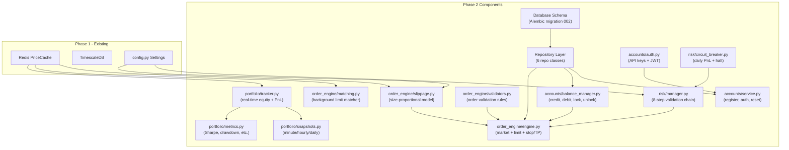

# Phase 2: Trading Engine Implementation Plan

## Current State

Phase 1 is **100% complete**: Binance WS streaming to Redis + TimescaleDB, 441 pairs seeded, all tests passing. The existing codebase provides:

- **ORM base**: `DeclarativeBase` in [src/database/models.py](src/database/models.py) with `Tick` and `TradingPair` models
- **Async sessions**: [src/database/session.py](src/database/session.py) with asyncpg pool + SQLAlchemy 2.0
- **Config**: [src/config.py](src/config.py) with trading settings (`trading_fee_pct`, `default_slippage_factor`, `default_starting_balance`, `jwt_secret`)
- **Redis cache**: [src/cache/price_cache.py](src/cache/price_cache.py) with `PriceCache.get_price()`, `get_ticker()` (needed by slippage calculator)
- **Dependencies**: [src/dependencies.py](src/dependencies.py) with `DbSessionDep`, `RedisDep`, `PriceCacheDep`
- **Migration baseline**: [alembic/versions/001_initial_schema.py](alembic/versions/001_initial_schema.py) (ticks hypertable + trading_pairs)

**Known issue**: `dependencies.py` imports `async_session_factory` but `session.py` exports `get_session_factory()` -- fix during this phase.

---

## Architecture Overview

