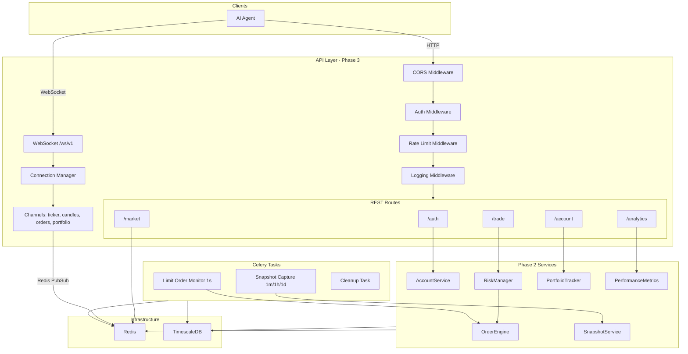

# Phase 3: API Layer Implementation Plan

## Current State

- **Phase 1 + 2 complete**: Price ingestion, Redis cache, DB, order engine, risk manager, portfolio tracker, accounts, all repositories, and full test suite are done
- `**src/main.py`** exists with a minimal FastAPI app (health router only, lifespan for DB init/close)
- `**src/dependencies.py`** has all DI providers ready (settings, DB, Redis, cache, all repos, all services)
- `**src/utils/exceptions.py`** has the full exception hierarchy with HTTP status codes and `to_dict()`
- `**src/price_ingestion/broadcaster.py`** publishes to Redis `price_updates` channel -- needs to be wired to WebSocket
- **No files exist yet** in `src/api/`, `src/tasks/`
- Dependencies already pinned: FastAPI, uvicorn, Celery, structlog, prometheus-client, pyjwt, bcrypt

---

## File Creation Order (one file per step per `.cursorrules`)

Each step creates exactly one file. Dependencies flow downward -- schemas before routes, middleware before routes, etc.

### Step 1: `src/api/__init__.py`

Empty package init for the API module.

### Step 2: `src/api/schemas/auth.py`

Pydantic v2 models per Section 15.1:

- `RegisterRequest` (display_name, email, starting_balance optional)
- `LoginRequest` (api_key, api_secret)
- `TokenResponse` (token, expires_at, token_type)
- `RegisterResponse` (account_id, api_key, api_secret, display_name, starting_balance, message)

### Step 3: `src/api/schemas/market.py`

Pydantic v2 models per Section 15.2:

- `PairResponse`, `PairsListResponse`
- `PriceResponse`, `PricesMapResponse`
- `TickerResponse`
- `CandleResponse`, `CandlesListResponse`
- `TradePublicResponse`, `TradesPublicResponse`
- `OrderbookResponse`

### Step 4: `src/api/schemas/trading.py`

Pydantic v2 models per Section 15.3:

- `OrderRequest` (symbol, side, type, quantity, price optional)
- `OrderResponse` (filled and pending variants via optional fields)
- `OrderListResponse`
- `CancelResponse`, `CancelAllResponse`
- `TradeHistoryResponse`

### Step 5: `src/api/schemas/account.py`

Pydantic v2 models per Section 15.4:

- `AccountInfoResponse` (with nested SessionInfo, RiskProfileInfo)
- `BalanceItem`, `BalancesResponse`
- `PositionItem`, `PositionsResponse`
- `PortfolioResponse`
- `PnLResponse`
- `ResetRequest`, `ResetResponse`

### Step 6: `src/api/schemas/analytics.py`

Pydantic v2 models per Section 15.5:

- `PerformanceResponse`
- `SnapshotItem`, `PortfolioHistoryResponse`
- `LeaderboardEntry`, `LeaderboardResponse`

### Step 7: `src/api/middleware/auth.py`

Authentication middleware and FastAPI dependency:

- `AuthMiddleware(BaseHTTPMiddleware)` -- extracts `X-API-Key` or `Authorization: Bearer` header
- Public endpoints whitelist: `/api/v1/auth/register`, `/api/v1/auth/login`, `/health`, `/docs`, `/redoc`, `/openapi.json`
- `get_current_account()` FastAPI dependency -- attaches authenticated account to request state
- Uses existing `src/accounts/auth.py` (verify_api_key, verify_jwt) and `AccountRepository`

### Step 8: `src/api/middleware/rate_limit.py`

Redis sliding-window rate limiter:

- Key pattern: `rate_limit:{api_key}:{group}:{minute_bucket}`
- Three tiers: general (600/min), orders (100/min), market data (1200/min)
- Injects `X-RateLimit-Limit`, `X-RateLimit-Remaining`, `X-RateLimit-Reset` headers
- Returns 429 `RateLimitExceededError` when limit exceeded

### Step 9: `src/api/middleware/logging.py`

structlog request/response logger:

- Log request method, path, status, latency, account_id (if authenticated)
- Bind structured fields for correlation (request_id via UUID4)
- Skip health check endpoint to reduce noise

### Step 10: `src/api/routes/auth.py`

APIRouter with prefix `/api/v1/auth`:

- `POST /register` -- calls `AccountService.register()`, returns `RegisterResponse`
- `POST /login` -- calls `AccountService.authenticate()` + `create_jwt()`, returns `TokenResponse`
- Wired to existing DI: `AccountServiceDep`

### Step 11: `src/api/routes/market.py`

APIRouter with prefix `/api/v1/market`:

- `GET /pairs` -- query `trading_pairs` table via DB session
- `GET /price/{symbol}` -- `PriceCache.get_price()`
- `GET /prices` -- `PriceCache.get_all_prices()`, optional `symbols` filter
- `GET /ticker/{symbol}` -- `PriceCache.get_ticker()`
- `GET /candles/{symbol}` -- query continuous aggregates (1m/5m/1h/1d) via `TickRepository`
- `GET /trades/{symbol}` -- query `ticks` table for recent trades
- `GET /orderbook/{symbol}` -- simulated orderbook from current price + spread

### Step 12: `src/api/routes/trading.py`

APIRouter with prefix `/api/v1/trade`:

- `POST /order` -- `RiskManager.validate_order()` then `OrderEngine.place_order()`
- `GET /order/{order_id}` -- `OrderRepository.get_by_id()`
- `GET /orders` -- `OrderRepository.list_by_account()` with status/symbol/side/limit/offset filters
- `GET /orders/open` -- `OrderRepository.list_open_by_account()`
- `DELETE /order/{order_id}` -- `OrderEngine.cancel_order()`
- `DELETE /orders/open` -- `OrderEngine.cancel_all_orders()`
- `GET /history` -- `TradeRepository.list_by_account()` with filters
- All require authenticated account via `get_current_account` dependency

### Step 13: `src/api/routes/account.py`

APIRouter with prefix `/api/v1/account`:

- `GET /info` -- `AccountRepository.get_by_id()` + session data
- `GET /balance` -- `BalanceManager.get_all_balances()` + total equity from tracker
- `GET /positions` -- `PortfolioTracker.get_positions()`
- `GET /portfolio` -- `PortfolioTracker.get_portfolio()`
- `GET /pnl` -- `PortfolioTracker.get_pnl()` with period filter
- `POST /reset` -- `AccountService.reset_account()`

### Step 14: `src/api/routes/analytics.py`

APIRouter with prefix `/api/v1/analytics`:

- `GET /performance` -- `PerformanceMetrics.calculate()` with period param
- `GET /portfolio/history` -- `SnapshotService.get_snapshot_history()` with interval/time filters
- `GET /leaderboard` -- cross-account ranking query (portfolio tracker aggregation)

### Step 15: `src/api/websocket/manager.py`

WebSocket connection manager:

- `ConnectionManager` class -- tracks active connections per account
- `connect()` -- authenticate via `api_key` query param, add to connection pool
- `disconnect()` -- remove from pool, clean up subscriptions
- Heartbeat: send `{"type":"ping"}` every 30s, disconnect if no pong within 10s
- Thread-safe connection set per account_id

### Step 16: `src/api/websocket/channels.py`

Channel definitions:

- `TickerChannel` -- `ticker:{symbol}` and `ticker:all`
- `CandleChannel` -- `candles:{symbol}:{interval}`
- `OrderChannel` -- `orders` (per-account order status updates)
- `PortfolioChannel` -- `portfolio` (per-account, every 5s)
- Each channel knows how to serialize its payload per Section 16

### Step 17: `src/api/websocket/handlers.py`

Subscribe/unsubscribe handler:

- Parse incoming JSON: `{"action":"subscribe/unsubscribe", "channel":"...", "symbol":"..."}`
- Rate limit: max 10 subscriptions per connection
- Bridge Redis pub/sub (`price_updates` channel) to WebSocket clients based on their subscriptions
- Background task per connection that reads from Redis pubsub and dispatches

### Step 18: Updated `src/main.py`

Rewrite app factory:

- Add CORS middleware (allow all origins in dev, configurable in prod)
- Register `AuthMiddleware`, `RateLimitMiddleware`, `LoggingMiddleware`
- Include all 5 route routers under `/api/v1` prefix
- Mount WebSocket endpoint at `/ws/v1`
- Startup: init DB + Redis pool + start Redis pubsub listener
- Shutdown: close DB + Redis + disconnect all WebSocket clients
- Mount Prometheus metrics at `/metrics`

### Step 19: `src/tasks/celery_app.py`

Celery configuration:

- Redis broker (`settings.REDIS_URL`)
- Task serializer: JSON
- Result backend: Redis
- Beat schedule: limit matcher (1s), minute snapshots (60s), hourly snapshots (3600s), daily snapshots + circuit breaker reset (86400s)

### Step 20: `src/tasks/limit_order_monitor.py`

Wraps `LimitOrderMatcher.run_matcher_once()` from `src/order_engine/matching.py` as a Celery task.

### Step 21: `src/tasks/portfolio_snapshots.py`

Celery tasks:

- `capture_minute_snapshots` -- iterate active accounts, call `SnapshotService.capture_minute_snapshot()`
- `capture_hourly_snapshots` -- same with hourly
- `capture_daily_snapshots` -- same with daily

### Step 22: `src/tasks/candle_aggregation.py`

Trigger TimescaleDB continuous aggregate refresh if manual refresh needed (likely a no-op since auto-refresh policies exist from Phase 1 migration).

### Step 23: `src/tasks/cleanup.py`

Cleanup tasks:

- Delete expired/stale pending orders (e.g., > 7 days old)
- Prune minute-resolution snapshots older than 7 days
- Archive old audit log entries

### Step 24: `Dockerfile.celery`

Docker image for Celery worker + beat, based on same Python base as API.

### Step 25: `src/utils/helpers.py`

Shared utilities:

- `parse_period(period: str) -> timedelta` (convert "1d"/"7d"/"30d"/"90d"/"all")
- `paginate(query, limit, offset)` helper
- `utc_now()` helper
- Any other shared formatters

### Step 26-30: Tests

- `tests/integration/test_auth_endpoints.py` -- register, login, invalid key, expired JWT
- `tests/integration/test_market_endpoints.py` -- all market data endpoints
- `tests/integration/test_trading_endpoints.py` -- place/cancel/list orders, trade history
- `tests/integration/test_websocket.py` -- connect, subscribe, receive price, heartbeat
- `tests/integration/test_rate_limiting.py` -- exceed limit, verify 429

---

## Architecture Diagram

---

## Key Implementation Notes

- **Auth dependency**: `get_current_account()` will be a FastAPI `Depends()` that reads `request.state.account` set by `AuthMiddleware`, falling back to header extraction if middleware is bypassed. Routes inject this to get the authenticated `Account` ORM object.
- **Error handling**: A global exception handler in `src/main.py` will catch all `TradingPlatformError` subclasses and return the structured `{"error": {...}}` JSON per Section 15.
- **Decimal serialization**: Pydantic v2 schemas will use `model_config = ConfigDict(json_encoders={Decimal: str})` or field-level `PlainSerializer` to ensure all Decimal values serialize as strings in JSON responses.
- **WebSocket auth**: The `/ws/v1` endpoint authenticates via `api_key` query parameter on connection. No middleware -- auth happens in the WebSocket handler itself.
- **Celery worker**: Runs synchronously by default. Each task will create its own async event loop (or use `asgiref.sync_to_async`) to call the existing async services. Alternatively, tasks can use `asyncio.run()` for simpler wiring.

