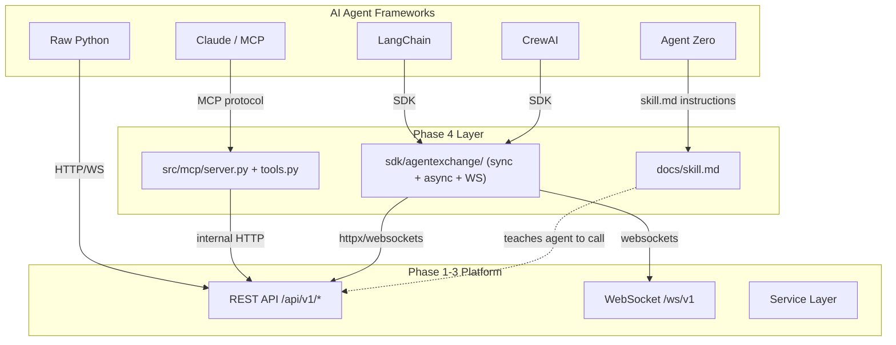

# Phase 4: Agent Connectivity

## Current State

- Phases 1-3 are complete (100%). All REST routes, WebSocket server, middleware, Celery tasks, and 303 integration tests are in place.
- `src/mcp/`, `sdk/`, and `docs/` directories do **not** exist yet -- all files are greenfield.
- Existing REST endpoints under `/api/v1/` (auth, market, trading, account, analytics) are the interface that both the MCP server and SDK will wrap.
- `httpx==0.28.1` and `websockets==14.1` are already in `requirements.txt`.

## Progress Tracker

| Step | File | Status |
| ---- | ---- | ------ |
| 1  | `src/mcp/__init__.py`                          | ✅ Done |
| 2  | `src/mcp/tools.py`                             | ✅ Done |
| 3  | `src/mcp/server.py`                            | ✅ Done |
| 4  | `sdk/agentexchange/__init__.py`                | ✅ Done |
| 5  | `sdk/agentexchange/exceptions.py`              | ✅ Done |
| 6  | `sdk/agentexchange/models.py`                  | ✅ Done |
| 7  | `sdk/agentexchange/client.py`                  | ✅ Done |
| 8  | `sdk/agentexchange/async_client.py`            | ✅ Done |
| 9  | `sdk/agentexchange/ws_client.py`               | ✅ Done |
| 10 | `sdk/pyproject.toml`                           | ✅ Done |
| 11 | `tests/unit/test_mcp_tools.py`                 | ✅ Done (71 tests) |
| 12 | `tests/unit/test_sdk_client.py`                | ❌ TODO |
| 13 | `docs/skill.md`                                | ❌ TODO |
| 14 | `docs/quickstart.md`                           | ❌ TODO |
| 15 | `docs/api_reference.md`                        | ❌ TODO |
| 16 | `docs/framework_guides/openclaw.md`            | ❌ TODO |
| 17 | `docs/framework_guides/langchain.md`           | ❌ TODO |
| 18 | `docs/framework_guides/agent_zero.md`          | ❌ TODO |
| 19 | `docs/framework_guides/crewai.md`              | ❌ TODO |
| 20 | `tests/integration/test_agent_connectivity.py` | ❌ TODO |

**11 / 20 complete**

## Architecture

## Implementation Order (17 tasks, one file at a time per cursor rules)

The plan follows the dependency graph: exceptions and models first (shared), then clients, then MCP server, then documentation, then tests.

---

### Block 1: MCP Server (Tasks 4.1.1 -- 4.1.2)

**4.1.1 -- `src/mcp/server.py`**

- MCP server process using the `mcp` Python package (official MCP SDK from Anthropic).
- Runs as a standalone process via `python -m src.mcp.server`.
- Initializes an internal `httpx.AsyncClient` pointed at `http://localhost:8000` (configurable via env `API_BASE_URL`).
- Authenticates to the REST API using the agent's API key passed via MCP server config.
- Registers all 12 tools from `tools.py` on startup.
- Uses `stdio` transport (standard for MCP servers).

**4.1.2 -- `src/mcp/tools.py`**

- Defines all 12 tools per Section 17 of [developmantPlan.md](developmantPlan.md):
  1. `get_price` -- GET /market/price/{symbol}
  2. `get_all_prices` -- GET /market/prices
  3. `get_candles` -- GET /market/candles/{symbol}?interval&limit
  4. `get_balance` -- GET /account/balance
  5. `get_positions` -- GET /account/positions
  6. `place_order` -- POST /trade/order
  7. `cancel_order` -- DELETE /trade/order/{order_id}
  8. `get_order_status` -- GET /trade/order/{order_id}
  9. `get_portfolio` -- GET /account/portfolio
  10. `get_trade_history` -- GET /trade/history
  11. `get_performance` -- GET /analytics/performance?period
  12. `reset_account` -- POST /account/reset
- Each tool: typed input schema, description, maps to REST call via httpx, returns JSON.
- New dependency: `mcp` package (Anthropic's official MCP SDK) added to `requirements.txt`.

---

### Block 2: Python SDK (Tasks 4.2.1 -- 4.2.6)

**4.2.1 -- `sdk/agentexchange/exceptions.py`**

- Base `AgentExchangeError(message, code, status_code, details)`.
- Subclasses: `AuthenticationError`, `RateLimitError`, `InsufficientBalanceError`, `OrderError`, `InvalidSymbolError`, `NotFoundError`, `ValidationError`, `ServerError`, `ConnectionError`.
- Factory function `raise_for_response(response)` that maps HTTP status + error code to the right exception.

**4.2.2 -- `sdk/agentexchange/models.py`**

- Frozen dataclasses for all API responses: `Price`, `Ticker`, `Candle`, `Balance`, `Position`, `Order`, `Trade`, `Portfolio`, `PnL`, `Performance`, `Snapshot`, `LeaderboardEntry`, `AccountInfo`.
- `from_dict(cls, data)` class method on each for deserialization.
- All monetary fields as `Decimal`.

**4.2.3 -- `sdk/agentexchange/client.py`** (sync)

- `AgentExchangeClient(api_key, api_secret, base_url="http://localhost:8000")`.
- Uses `httpx.Client` with `X-API-Key` header.
- Login on init to obtain JWT, refresh before expiry.
- All methods from Section 18: market data (6), trading (8), account (5), analytics (3) = 22 methods total.
- Auto-retry on 5xx with exponential backoff (1s/2s/4s, max 3).
- Returns typed model objects, not dicts.
- `close()` method for cleanup.

**4.2.4 -- `sdk/agentexchange/async_client.py`** (async)

- `AsyncAgentExchangeClient` -- same 22 methods, all `async`.
- Uses `httpx.AsyncClient`.
- Async context manager support (`async with ... as client:`).
- Same retry/auth logic as sync client.

**4.2.5 -- `sdk/agentexchange/ws_client.py`** (WebSocket)

- `AgentExchangeWS(api_key, base_url="ws://localhost:8000")`.
- Decorator-based handlers: `@ws.on_ticker(symbol)`, `@ws.on_order_update()`, `@ws.on_portfolio()`.
- Uses `websockets` library.
- Auto-reconnect with exponential backoff (1s to 60s).
- Built-in heartbeat (responds to server ping with pong).
- `connect()` blocks and runs the event loop; `subscribe()`/`unsubscribe()` for channel management.

**4.2.6 -- `sdk/setup.py` (or `sdk/pyproject.toml`) + `sdk/agentexchange/__init__.py`**

- Package metadata: name=`agentexchange`, version=`0.1.0`.
- Dependencies: `httpx>=0.28`, `websockets>=14.0`.
- Exports: `AgentExchangeClient`, `AsyncAgentExchangeClient`, `AgentExchangeWS`, all models, all exceptions.
- Installable via `pip install -e sdk/` or `pip install agentexchange`.

---

### Block 3: Documentation (Tasks 4.3.1 -- 4.3.5)

**4.3.1 -- `docs/skill.md`**

- Comprehensive LLM-readable instruction file per Section 19.
- Covers: auth, all endpoints with examples, error handling, best practices, WebSocket.
- Optimized for AI consumption -- concise, structured, zero ambiguity.

**4.3.2 -- `docs/quickstart.md`**

- 5-minute getting started: Docker up, register, get price, place order, check portfolio.
- Code samples in Python (SDK) and raw curl.

**4.3.3 -- `docs/api_reference.md`**

- Full REST API reference: every endpoint, request/response schemas, error codes.

**4.3.4 -- `docs/framework_guides/` (4 files)**

- `openclaw.md` -- OpenClaw integration with skill.md.
- `langchain.md` -- LangChain custom tool wrapping the SDK.
- `agent_zero.md` -- Agent Zero integration with skill.md.
- `crewai.md` -- CrewAI tool integration with the SDK.

---

### Block 4: Testing (Tasks 4.4.1 -- 4.4.3)

**4.4.1 -- SDK unit tests** (`tests/unit/test_sdk_client.py`)

- Mock httpx responses, verify all 22 methods return correct model types.
- Test retry logic on 5xx, exception raising on 4xx.
- Test WebSocket client connect/subscribe/handler dispatch.

**4.4.2 -- MCP tool tests** (`tests/unit/test_mcp_tools.py`)

- Mock httpx calls, verify all 12 tools return expected schemas.
- Test error propagation (API errors surfaced in tool response).

**4.4.3 -- Multi-framework integration test** (`tests/integration/test_agent_connectivity.py`)

- 10 concurrent agents using SDK (mix of sync/async).
- MCP tool discovery and execution end-to-end.
- skill.md validation: parse and verify all endpoints listed are valid.

---

## File Creation Order (one file per step)

| Step | File                                           | Block |
| ---- | ---------------------------------------------- | ----- |
| 1    | `src/mcp/__init__.py`                          | MCP   |
| 2    | `src/mcp/tools.py`                             | MCP   |
| 3    | `src/mcp/server.py`                            | MCP   |
| 4    | `sdk/agentexchange/__init__.py`                | SDK   |
| 5    | `sdk/agentexchange/exceptions.py`              | SDK   |
| 6    | `sdk/agentexchange/models.py`                  | SDK   |
| 7    | `sdk/agentexchange/client.py`                  | SDK   |
| 8    | `sdk/agentexchange/async_client.py`            | SDK   |
| 9    | `sdk/agentexchange/ws_client.py`               | SDK   |
| 10   | `sdk/pyproject.toml`                           | SDK   |
| 11   | `tests/unit/test_mcp_tools.py`                 | Tests |
| 12   | `tests/unit/test_sdk_client.py`                | Tests |
| 13   | `docs/skill.md`                                | Docs  |
| 14   | `docs/quickstart.md`                           | Docs  |
| 15   | `docs/api_reference.md`                        | Docs  |
| 16   | `docs/framework_guides/openclaw.md`            | Docs  |
| 17   | `docs/framework_guides/langchain.md`           | Docs  |
| 18   | `docs/framework_guides/agent_zero.md`          | Docs  |
| 19   | `docs/framework_guides/crewai.md`              | Docs  |
| 20   | `tests/integration/test_agent_connectivity.py` | Tests |

## Dependencies to Add

- `mcp` -- Anthropic's official MCP SDK for Python (to `requirements.txt`)
- `httpx>=0.28` and `websockets>=14.0` -- already present in main `requirements.txt`; also listed as SDK package deps in `sdk/pyproject.toml`

## Key Decisions

- MCP server uses **stdio transport** (standard for local MCP servers) and communicates with the platform via internal HTTP calls to the REST API, not by importing service layer directly. This keeps MCP as a thin bridge.
- SDK uses `httpx` (already in requirements) for both sync and async clients, not `requests`.
- WebSocket client uses `websockets` (already in requirements).
- All SDK response models use frozen `dataclasses` with `Decimal` for monetary values.
- `sdk/pyproject.toml` over `setup.py` for modern packaging.
