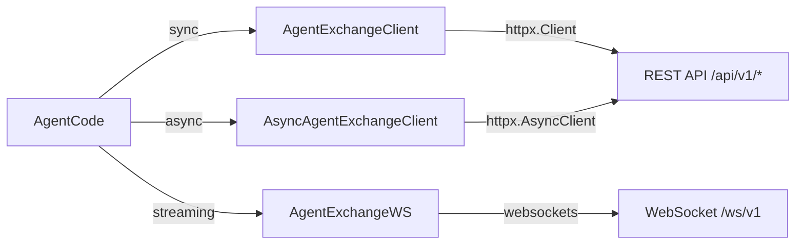

# Phase 4 Remaining Todos

Complete 9 tasks in the order shown below (one file per step per `.cursorrules`).

## Key files to reference while implementing

- `[sdk/agentexchange/client.py](sdk/agentexchange/client.py)` — 22 sync methods (market x6, trading x8, account x5, analytics x3)
- `[sdk/agentexchange/async_client.py](sdk/agentexchange/async_client.py)` — same 22 methods, all `async`
- `[sdk/agentexchange/ws_client.py](sdk/agentexchange/ws_client.py)` — `AgentExchangeWS`, decorator handlers, reconnect loop
- `[sdk/agentexchange/models.py](sdk/agentexchange/models.py)` — 13 frozen dataclasses (`Price`, `Order`, `Balance`, etc.)
- `[sdk/agentexchange/exceptions.py](sdk/agentexchange/exceptions.py)` — `AgentExchangeError` + 10 subclasses + `raise_for_response`
- `[tests/unit/test_mcp_tools.py](tests/unit/test_mcp_tools.py)` — style reference for unit tests

## Data flow reminder

---

## Step 12 — `tests/unit/test_sdk_client.py`

Mock `httpx` responses (no real server). Cover:

- All 22 sync methods on `AgentExchangeClient` return the correct model type
- `_login` stores JWT; `_ensure_auth` refreshes when expired
- 5xx triggers retry × 3 with back-off; 4th attempt raises typed exception
- `raise_for_response` maps each HTTP status / error code to the right exception class
- `AgentExchangeWS` decorator registration (`on_ticker`, `on_order_update`, `on_portfolio`) and `_dispatch` routing
- Use `respx` (already in dev deps) to mock `httpx`; use `unittest.mock` for WS

---

## Step 13 — `docs/skill.md`

LLM-readable instruction file — per Section 19 of `[developmantPlan.md](developmantPlan.md)`. Structure:

- Platform overview (1 paragraph)
- Authentication: how to get `api_key` / `api_secret`, how to pass them
- All endpoints grouped by category with: method, path, required params, example request + response
- Error codes table
- WebSocket channels and message shapes
- Best-practice tips (check price before order, handle `RateLimitError`, use `reset_account` to restart)

---

## Step 14 — `docs/quickstart.md`

5-minute getting-started guide:

1. Docker up
2. Register account (curl + SDK)
3. Get a price
4. Place a market order
5. Check portfolio

Both curl and Python SDK code samples for each step.

---

## Step 15 — `docs/api_reference.md`

Full REST API reference. Every endpoint:

- Method + path
- Auth requirement
- Query / body parameters with types
- Response schema (field names, types)
- Error codes that can be returned
- Curl example

---

## Steps 16–19 — `docs/framework_guides/`

Four files, one per framework:

- `**openclaw.md**` — point at `docs/skill.md` as the skill file; show how to register it in OpenClaw config
- `**langchain.md**` — wrap SDK methods as `Tool` objects; show `AgentExecutor` wiring
- `**agent_zero.md**` — show how to drop `skill.md` into Agent Zero's skill directory
- `**crewai.md**` — wrap SDK methods as CrewAI `tool` decorated functions; show `Agent` + `Task` setup

---

## Step 20 — `tests/integration/test_agent_connectivity.py`

Requires no live infrastructure (mock the REST API with `respx`). Cover:

- 10 concurrent `AsyncAgentExchangeClient` instances calling `get_price` simultaneously
- MCP tool list discovery: instantiate `register_tools`, call `list_tools`, assert 12 tools present
- MCP tool execution: call `_dispatch("get_price", ...)` with mocked HTTP, assert `TextContent` returned
- `skill.md` validation: parse the file, extract all endpoint paths, assert each path starts with `/api/v1/`

